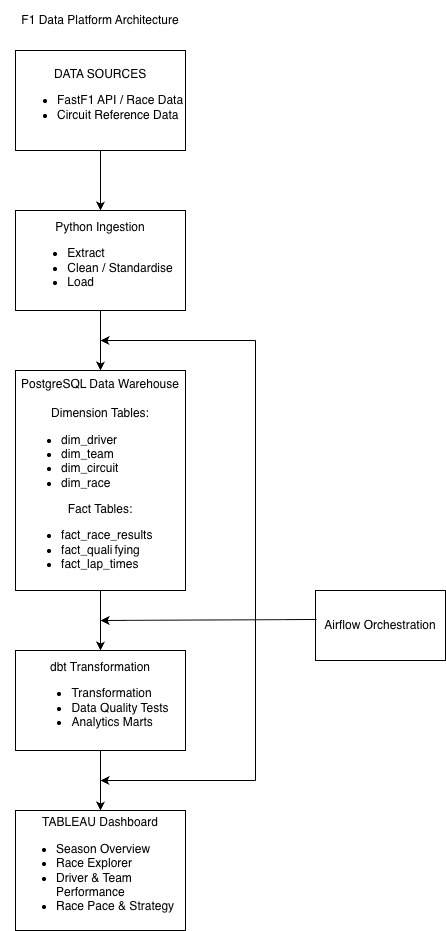

# F1 Data Platform

An end-to-end Formula 1 data engineering project that transforms race data into a structured analytical warehouse and interactive Tableau dashboards.

The project extends my previous Formula 1 analytics work by focusing on data ingestion, dimensional modelling, transformation, orchestration, and BI reporting.

## Architecture

FastF1 / Circuit Reference Data  
→ Python Ingestion  
→ PostgreSQL Data Warehouse  
→ dbt Transformations  
→ Tableau Dashboard

Apache Airflow will be used to orchestrate the pipeline.



## Tech Stack

- Python
- FastF1
- PostgreSQL
- dbt Core
- Apache Airflow
- Tableau
- Git / GitHub

## Data Warehouse

The warehouse currently contains seven core tables.

### Dimension Tables

- `dim_driver`
- `dim_team`
- `dim_circuit`
- `dim_race`

### Fact Tables

- `fact_race_results`
- `fact_qualifying`
- `fact_lap_times`

The model uses shared dimensions across multiple fact tables to support race, qualifying, lap-level, driver, team, and circuit analysis.

## Planned Tableau Dashboard

### Season Overview
- Races completed
- Driver Championship standings
- Constructor Championship standings
- Average finishing position
- Driver consistency

### Race Explorer
- Starting vs finishing position
- Positions gained/lost
- Race winner
- Pole sitter
- Driver position throughout the race

### Driver & Team Performance
- Points
- Wins
- Podiums
- Average qualifying position
- Average finishing position
- Driver comparison
- Race completion percentage

### Race Pace & Strategy
- Lap-time progression
- Tyre strategy
- Tyre degradation
- Fastest-lap comparison

## Current Progress

- [x] Project architecture designed
- [x] PostgreSQL warehouse created
- [x] Dimension and fact tables designed
- [x] Primary and foreign key relationships implemented
- [ ] Python ingestion pipeline
- [ ] Load FastF1 data into PostgreSQL
- [ ] dbt transformations and data quality tests
- [ ] Airflow orchestration
- [ ] Tableau dashboard

## Project Structure

```text
f1-data-platform/
├── data/
├── docs/
│   |──f1_warehouse_schema_reference.txt
|.  └── Arch_diagram.jpg
├── sql/
│   └── create_tables.sql
├── src/
│   ├── extract/
│   ├── load/
│   └── config/
├── dbt/
├── airflow/
├── dashboards/
├── tests/
└── requirements.txt
